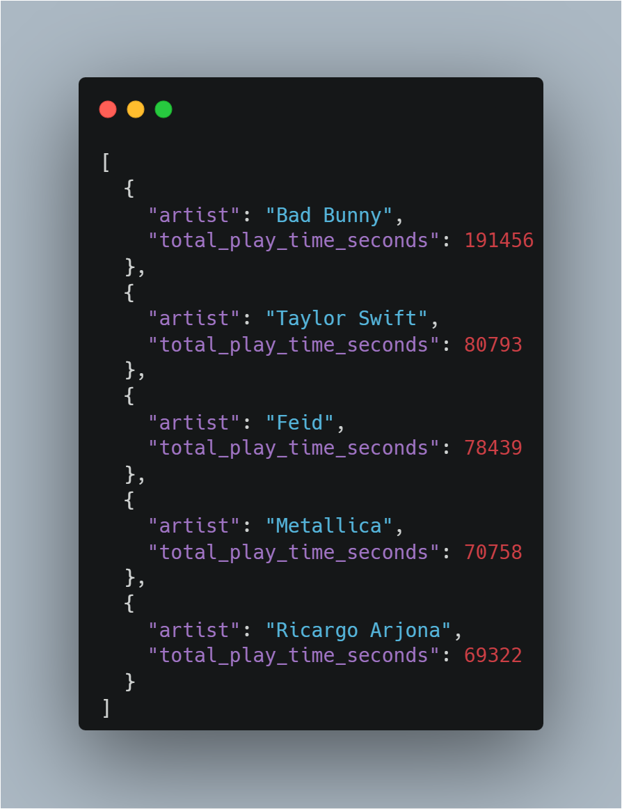
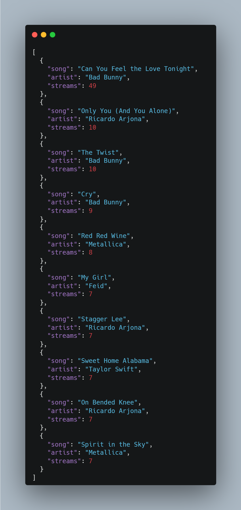
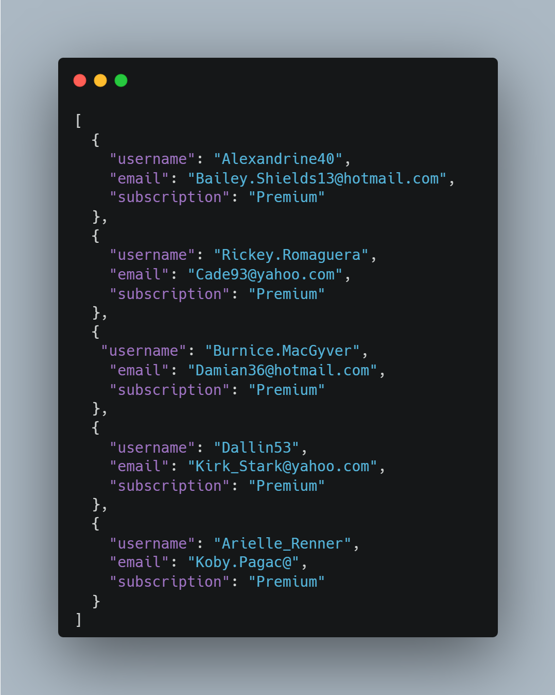
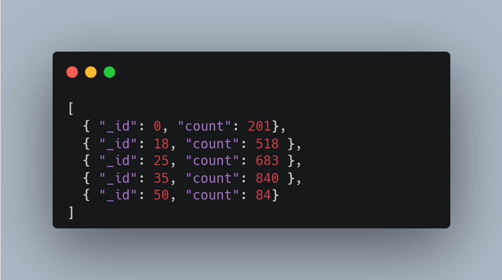
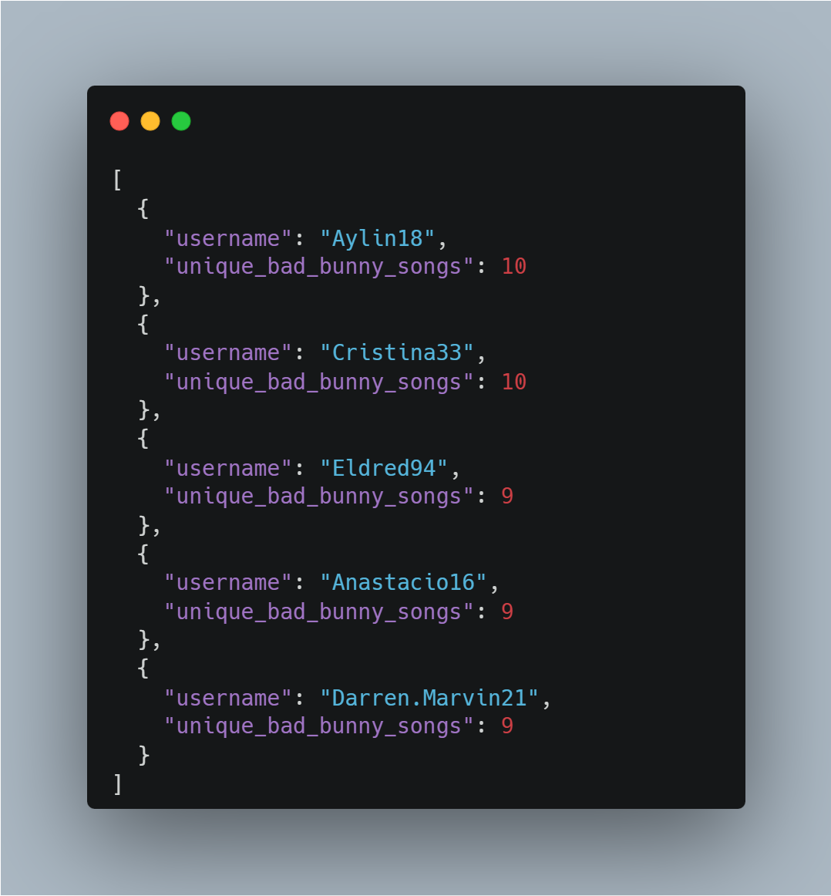

# Apple Music Analytics API Specification

Esta documentación define los endpoints RESTful para alimentar el Dashboard Ejecutivo de Apple Music.

---

## 1. Reporte de Regalías
Devuelve la duración total de reproducción agrupada por artista.

* **Endpoint:** `GET /api/analytics/royalties`
* **Query Params:** `?period=30d` (default)
* **Response Preview:**

---

## 2. Top 10 Regional
Top canciones más escuchadas filtradas por país.

* **Endpoint:** `GET /api/charts/top-songs`
* **Query Params:** `?country=GT&days=7`
* **Response Preview:**

---

## 3. Usuarios Zombies (Churn Risk)
Lista usuarios Premium sin actividad reciente.

* **Endpoint:** `GET /api/users/zombies`
* **Query Params:** `?days_inactive=30`
* **Response Preview:**

---

## 4. Demografía
Distribución de edades filtrada por género musical.

* **Endpoint:** `GET /api/analytics/demographics`
* **Query Params:** `?genre=Reggaeton`
* **Response Preview:**

---

## 5. Heavy Users (Gamification)
Usuarios con mayor diversidad de escucha de un artista específico.

* **Endpoint:** `GET /api/users/heavy-listeners`
* **Query Params:** `?artist=Bad%20Bunny&limit=5`
* **Response Preview:**

